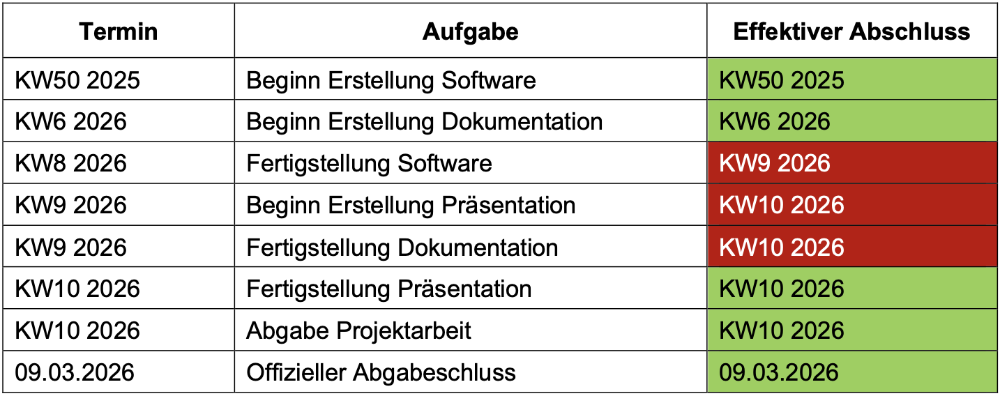
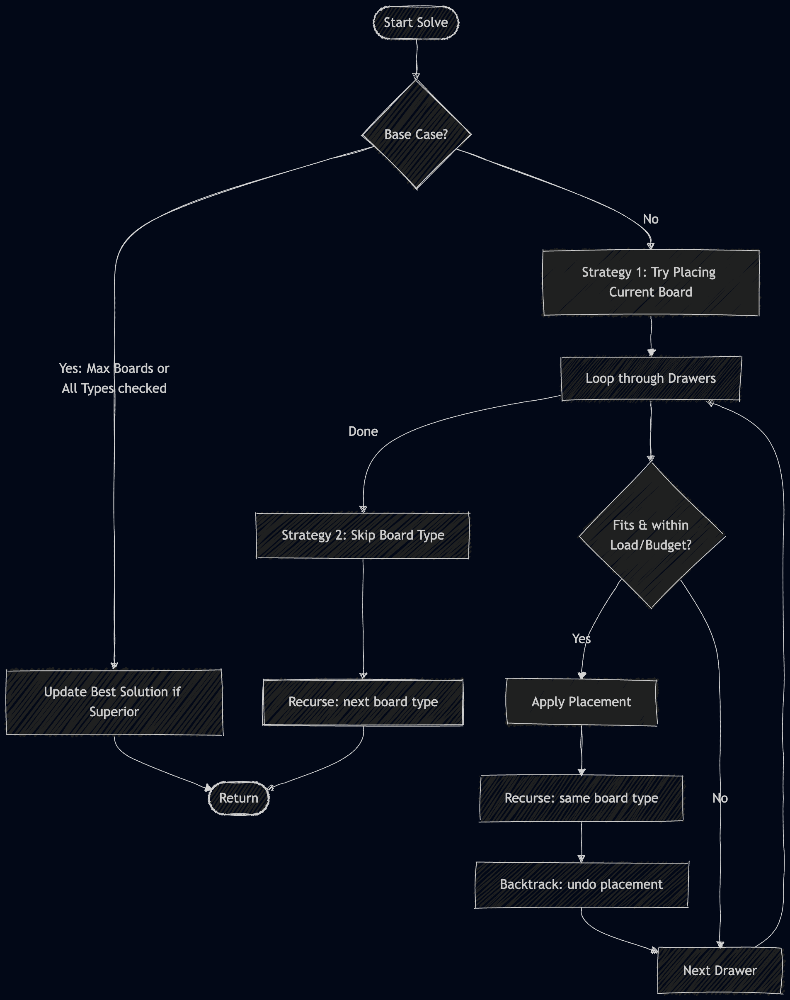
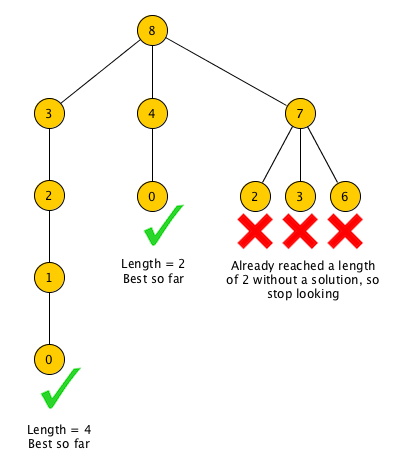

# Presentation

## ToC

- [Vorwort](#vorwort)
- [Ablauf](#ablauf)
  - [Grob](#grob)
  - [Implementierung & Aufbau](#implementierung--aufbau)
    - [Algorithmus](#algorithmus)
    - [Recursive Backtracking Lösungsbaum](#recursive-backtracking-lösungsbaum)
- [Schlussergebnis](#schlussergebnis)
- [QR-Code & Links](#qr-code--links)

## Vorwort

Aufgrund des folgenden Satzes, der in der Aufgabenstellung vorhanden war, wurde die Aufgabe nicht wie gedacht gelöst.
Da dieser Satz erst kurz vor dem Abgabetermin entfernt wurde, berücksichtigt die Software im aktuellen Stand diesen Satz.
Es ist mit dem DOzenten abgesprochen, dass das in Ordnung ist.

> […] Anschliessend wird für jede Schublade die gewünschte Stückzahl von Brettern angegeben, die Frau Koch kaufen möchte. […]

Auch wurde die Benutzeroberfläche nicht durch reine Texteingbane in der Konsole implementiert.
Somit sind auch Dinge wie das Löschen oder Bearbeiten von Schubladen und Brettern möglich.

## Ablauf

### Grob

### Implementierung & Aufbau

1. Planung der Projektstruktur
2. Planung der Datenstruktur & Benutzeroberfläche
3. Implementierung der Datenstruktur & Benutzeroberfläche
4. Implementierung des Lösungsalgorithmus

#### Algorithmus

#### Recursive Backtracking Lösungsbaum

## Schlussergebnis

Kurze Demo des Programms.

## QR-Code & Links

* [GitHub Repository](https://github.com/SayHeyD/teko-turtle/tree/main/Graded_Assignments/cutting-board-drawers-optimizer)
