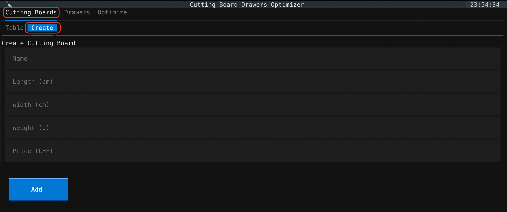
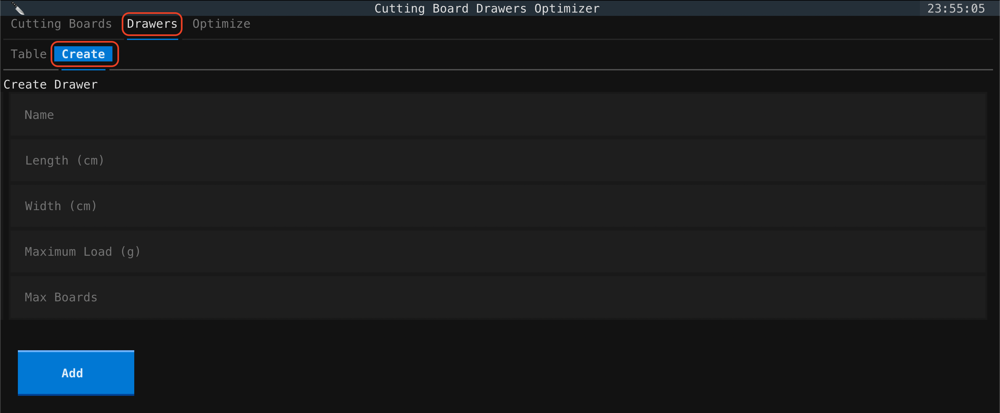
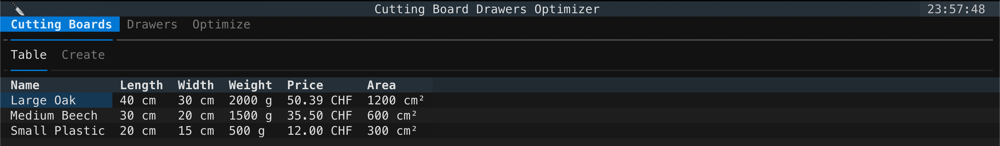
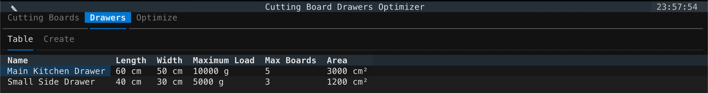
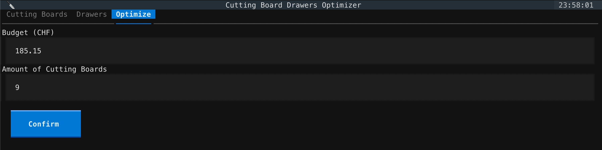
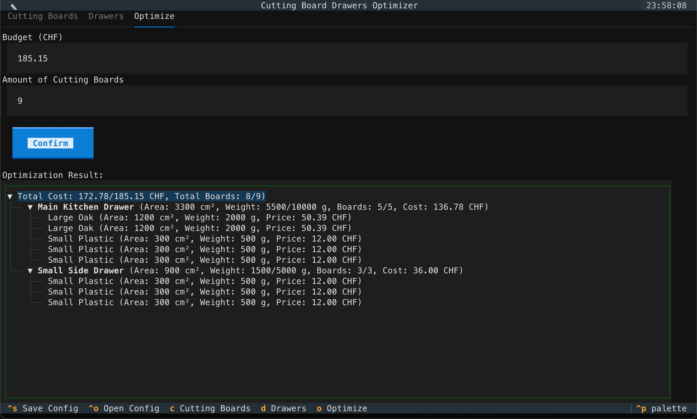

# Cutting Board Drawers Optimizer

An application for calculating which cutting boards optimally fit into which kitchen drawers.

[](https://github.com/SayHeyD/teko-turtle/actions/workflows/cutting-board-drawers-optimizer.yml)

-----

## Table of Contents

- [Keyboard Shortcuts](#keyboard-shortcuts)
- [Prerequisites](#prerequisites)
- [Installation](#installation)
- [Development](#development)
- [Usage](#usage)
- [License](#license)

## Keyboard Shortcuts

| Shortcut   | Action                                        |
|:-----------|:----------------------------------------------|
| `c`        | Switch to **Cutting Boards** tab              |
| `d`        | Switch to **Drawers** tab                     |
| `o`        | Switch to **Optimize** tab                    |
| `Ctrl + S` | **Save** current configuration to JSON        |
| `Ctrl + O` | **Open** a configuration from JSON            |
| `Ctrl + N` | Switch to the **Create** tab within a manager |
| `Ctrl + E` | **Edit** the selected row in a table          |
| `Ctrl + D` | **Delete** the selected row in a table        |
| `Enter`    | Submit a form or confirm an action            |

## Prerequisites

[Hatch 1.16](https://hatch.pypa.io/1.16/) or newer is required to use all development commands.

## Installation

```shell
pip install cutting-board-drawers-optimizer
```

## Development

### Run the application

```shell
hatch run start
```

### Run tests

```shell
hatch test
```

### Linting

Fix issues automatically:

```shell
hatch fmt
```

Check only:

```shell
hatch fmt --check
```

### Type checking

```shell
hatch run types:check
```

## Cleanup envs

Can be necessary after e.g. homebrew upgrades of python versions:

```shell
hatch env remove test
```

## Usage

First of all, add some drawers and cutting boards.





After adding some drawers and cutting boards, they show up on the table.





Then you can input your budget and total number of boards.



After confirming, you will be shown the results.



* You can also edit the drawers and cutting boards by selecting them in the table and using the keyboard shortcut 
`Ctrl + E`.

* You can also delete the drawers and cutting boards by selecting them in the table and using the keyboard shortcut 
`Ctrl + D`.

* You can also save the current configuration by using the keyboard shortcut `Ctrl + S`.
If the provided file already exists, it will be overwritten.
* You can also open a configuration by using the keyboard shortcut `Ctrl + O`.


## License

`cutting-board-drawers-optimizer` is distributed under the terms of the [MIT](https://spdx.org/licenses/MIT.html) license.
